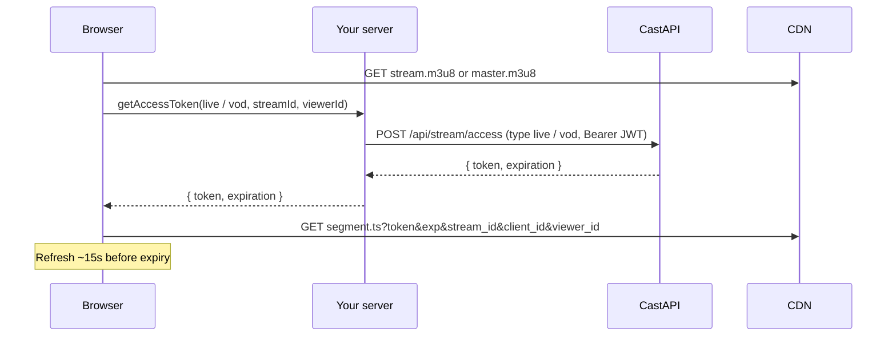

# `@convay/cast-sdk`

Browser SDK for **gated HLS playback** — live and on-demand (VOD) streams.

You render a player and supply a `getAccessToken` callback that hits **your** server. The SDK **never calls CastAPI**. Secrets stay on the server; the browser only gets short-lived segment tokens.

**Status:** Live playback implemented. VOD is designed here (`TYPES.VOD` / `type: 'vod'`) but not shipped in the SDK or CastAPI yet.

**In scope:** playback auth for live and VOD.  
**Out of scope:** stream lifecycle (create, upload, transcode, delete, billing) — your app and CastAPI handle those.

---

## Install

```bash
npm install @convay/cast-sdk hls.js
# React apps also need:
npm install react react-dom
```

Until the package is published:

```bash
npm install ../stream-web-sdk
npm install hls.js
```

`hls.js` is a peer dependency. `react` is only required for `@convay/cast-sdk/react`.

---

## System context

```
Browser  ──>  Your server  ──>  CastAPI  ──>  CDN (Owncast / Cloudflare)
```

| System | Role |
|--------|------|
| **Your app (browser)** | Renders player, passes `type`, `streamId`, `playbackUrl`, `getAccessToken` |
| **Your server** | Holds CastAPI JWT; validates viewer; forwards access requests |
| **CastAPI** | Mints segment tokens; validates ownership of the stream |
| **CDN** | Serves HLS; validates token + query params on `.ts` requests |

Stream keys, login, upload, status, and end-stream are **your server + CastAPI** concerns — not the SDK.

---

## Choose an integration path

Four paths - **pick one depending upon your implementaion**. Same segment auth for all.

| Path | Import | When to use |
|------|--------|-------------|
| **`CastPlayer`** | `@convay/cast-sdk/react` | React apps |
| **`<cast-player>`** | `@convay/cast-sdk/element` | Vue, Angular, Svelte, plain HTML |
| **`createCastPlayer`** | `@convay/cast-sdk` | You already have a `<video>` |
| **Headless helpers** | `@convay/cast-sdk` | Full control over the `hls.js` instance |

React and the web component both use `createCastPlayer` internally. Headless wires `createTokenRefreshFunction` + `createHlsConfig` yourself.

All paths accept `type: TYPES.LIVE | TYPES.VOD` and the same `streamId`.

### 1. React `CastPlayer`

```tsx
import { CastPlayer, TYPES } from '@convay/cast-sdk/react';

<CastPlayer
  type={TYPES.LIVE}
  streamId={streamId}
  clientId={clientId}
  playbackUrl={viewUrl}
  getAccessToken={async ({ streamId, viewerId }) => {
    // Demo placeholder — replace with a call to your server
    return { token: '…', expiration: 0 };
  }}
/>
```

VOD uses the same props with `type={TYPES.VOD}`.

| Prop | Required | Notes |
|------|----------|--------|
| `type` | yes | `TYPES.LIVE` (only implemented path today) |
| `streamId` | yes | Stream id (live or VOD - inferred from `type`) |
| `clientId` | yes | Account id; attached to `.ts` URLs |
| `playbackUrl` | yes | HLS playlist URL |
| `getAccessToken` | yes | Returns `{ token, expiration }` (unix seconds) |
| `viewerId` | no | Override SDK-managed viewer id |
| `autoPlay` / `muted` / `controls` / `className` / `poster` | no | Passed through to `<video>` (`className` is on the wrapper) |
| `onError` / `onReady` | no | Fatal HLS errors; manifest parsed |

Built-in chrome (no extra props):

- **Quality** — Auto (ABR) plus available ladder levels
- **Sync to live** — shown for `TYPES.LIVE`; jumps to the live edge
- **Seek** — native controls stay on. Live seeks past the available edge are clamped; VOD (when shipped) allows full seek

`viewerId` is optional. If omitted, the SDK stores a UUID in `localStorage` (`cast_sdk:viewer_id`).

### 2. `<cast-player>` web component

Import registers the tag. Prefer React `CastPlayer` in React apps.

```html
<script type="module">
  import '@convay/cast-sdk/element';

  const el = document.querySelector('cast-player');
  // Demo placeholder — replace with a call to your server
  el.getAccessToken = async ({ streamId, viewerId }) => {
    return { token: '…', expiration: 0 };
  };
  el.addEventListener('ready', () => console.log('ready'));
  el.addEventListener('error', (e) => console.error(e.detail));
  el.addEventListener('levels', (e) => console.log(e.detail));
</script>

<cast-player
  type="live"
  stream-id="abc123"
  client-id="partnerClient12"
  playback-url="https://cdn.example/hls/abc123/stream.m3u8"
></cast-player>
```

`getAccessToken` must be a **JS property** (not an HTML attribute). Events: `ready`, `error` (`detail` is an `Error`), `levels` (`detail` is `QualityLevel[]`).

Same quality + Sync to live chrome as React. Methods: `syncToLive()`, `setLevel(n)`, `getLevels()`, `getCurrentLevel()`.

| Attribute | Maps to |
|-----------|---------|
| `type` | `live` \| `vod` |
| `stream-id` | `streamId` |
| `client-id` | `clientId` |
| `playback-url` | `playbackUrl` |
| `viewer-id` | optional |
| `autoplay` / `muted` / `controls` / `poster` | video element |

### 3. `createCastPlayer` (vanilla)

```js
import { createCastPlayer, TYPES } from '@convay/cast-sdk';

const player = createCastPlayer(videoElement, {
  type: TYPES.LIVE,
  streamId,
  clientId,
  playbackUrl,
  getAccessToken,
  onError: (err) => console.error(err),
  onReady: () => console.log('ready'),
  onLevels: (levels) => console.log(levels),
  onLevelChange: (level) => console.log(level),
});

player.setLevel(-1); // Auto ABR
player.syncToLive(); // live only
player.destroy();
```

| Handle method | Notes |
|---------------|--------|
| `getLevels()` / `getCurrentLevel()` / `setLevel(n)` | `-1` = Auto |
| `syncToLive()` | Seek to live edge + play; no-op for VOD |
| `isLive()` | Based on `type` |
| `destroy()` | Tear down hls.js and listeners |

Live seek clamp and ABR default (`currentLevel = -1`) are applied inside the controller. Build your own UI with these methods, or use React / `<cast-player>` for the built-in chrome.

### 4. Headless (own hls.js)

```js
import Hls from 'hls.js';
import { createTokenRefreshFunction, createHlsConfig, TYPES } from '@convay/cast-sdk';

const tokenRefresh = createTokenRefreshFunction({
  type: TYPES.LIVE,
  streamId,
  clientId,
  viewerId,
  getAccessToken,
});

const hls = new Hls(createHlsConfig({ playbackUrl, tokenRefresh }));
hls.loadSource(playbackUrl);
hls.attachMedia(videoElement);
```

---

## Identifiers

VOD is treated as a stream too. Always use `streamId`; `type` tells live vs VOD.

| Name | Format (live) | Format (VOD) | Where it lives | Role |
|------|---------------|--------------|----------------|------|
| `clientId` | 12-char id | same | You pass to SDK | Account that owns the stream; bound into token + query params |
| `streamId` | 15-char base36 | e.g. `asset_…` | Your app | The stream being played |
| `viewerId` | UUID | UUID | Browser (`localStorage`) unless overridden | Viewer fingerprint; bound into token |
| `playbackUrl` | HLS playlist URL | HLS playlist URL | Your app | `.m3u8` URL; loaded **without** auth |

You obtain `streamId`, `clientId`, and `playbackUrl` from your own APIs (share links, CMS, etc.).

### Credentials

| Credential | Lives in | Purpose |
|------------|----------|---------|
| CastAPI JWT | Your server only | CastAPI access calls |
| Segment token | Browser (short TTL, ~2 min) | Query param on `.ts` URLs |
| `viewerId` | Browser | Bound into segment token |

---

## Playback modes

```ts
import { TYPES } from '@convay/cast-sdk';

TYPES.LIVE  // live broadcast
TYPES.VOD   // recorded / on-demand stream
```

| | **Live** (`TYPES.LIVE`) | **VOD** (`TYPES.VOD`) |
|--|-------------------------|------------------------|
| `streamId` means | live stream id | VOD stream id |
| `playbackUrl` | e.g. `https://cdn/hls/{id}/stream.m3u8` | e.g. `https://cdn/vod/{id}/index.m3u8` |
| Playlist auth | None | None |
| Segment auth | Token on `.ts` only | Same model |
| Segment query param | `stream_id` | `stream_id` |
| Token refresh | Yes (~15s before expiry) | Yes (same; long streams need refresh) |
| CDN billing metric | Viewer-minutes | Bytes transferred |

---

## Segment auth

1. **Playlist** (`.m3u8`) — no auth.
2. **First `.ts` request** — SDK calls `getAccessToken({ type, streamId, clientId, viewerId })` -> your server -> CastAPI.
3. **Segment URLs** — SDK appends auth query params (below).
4. **Refresh** — ~15s before expiry (with ±3s jitter).

### Segment query params

| Param | Live | VOD |
|-------|------|-----|
| `token` | ✓ | ✓ |
| `exp` | ✓ (unix seconds) | ✓ |
| `client_id` | ✓ | ✓ |
| `viewer_id` | ✓ | ✓ |
| `stream_id` | ✓ (= `streamId`) | ✓ (= `streamId`) |

Live and VOD use the same query param names. `type` is only used when requesting a token (your server / CastAPI), not on the CDN URL. Minting is CastAPI’s responsibility.

---

## Your server contract

### Browser -> your server

`getAccessToken` receives:

```ts
{ type: 'live' | 'vod', streamId: string, clientId: string, viewerId: string }
```

Your server responds:

```json
{ "token": "<segment-token>", "expiration": 1735689600 }
```

(`expiration` is unix seconds.)

Example route (conceptual):

```
POST /api/cast/access
Body: { type, streamId, viewerId }   // clientId may come from session instead
```

### Your server -> CastAPI

One access endpoint for live and VOD:

| CastAPI route | Request body | Auth |
|---------------|--------------|------|
| `POST /api/stream/access` | `{ type, stream_id, viewer_id }` | `Bearer <CastAPI JWT>` |

`type` is `'live'` or `'vod'`. CastAPI uses it for ownership / playability rules, then returns `{ token, expiration }`.

Keep the CastAPI JWT on the server. Errors propagate via `getAccessToken` throw / non-2xx.

---

## Playback flows



---

## Package layout

| Import | Use for |
|--------|---------|
| `@convay/cast-sdk` | `createCastPlayer`, quality/sync handle API, HLS helpers, `TYPES`, token refresh |
| `@convay/cast-sdk/react` | React `CastPlayer` (quality + Sync to live chrome) |
| `@convay/cast-sdk/element` | `<cast-player>` web component (same chrome) |

---

## Security

- **Never** expose the CastAPI JWT to the browser.
- Your server validates the viewer (session, share token, paywall, etc.) before calling CastAPI access.
- Only short-lived segment tokens reach the client.
- Tokens are bound to `client_id`, `stream_id`, and `viewer_id` — CDN rejects mismatched params.

---

## Types (reference)

```ts
export const TYPES = { LIVE: 'live', VOD: 'vod' } as const;

export type AccessTokenRequest = {
  type: PlaybackType;
  streamId: string;
  clientId: string;
  viewerId: string;
};

export type AccessTokenDetails = {
  token: string;
  expiration: number; // unix seconds
};

export type GetAccessToken = (ctx: AccessTokenRequest) => Promise<AccessTokenDetails>;

export type QualityLevel = {
  index: number;
  height?: number;
  width?: number;
  bitrate?: number;
  name: string;
};
```

### Segment `.ts` URL format

Playlists (`.m3u8`) are fetched without auth. Each segment request is rewritten to:

```
https://cdn.example/{path-to-segment}/segment.ts?token=<token>&exp=<expiration>&stream_id=<streamId>&client_id=<clientId>&viewer_id=<viewerId>
```

| Query param | Source |
|-------------|--------|
| `token` | From `getAccessToken` -> `{ token }` |
| `exp` | From `getAccessToken` -> `{ expiration }` (unix seconds) |
| `stream_id` | SDK `streamId` |
| `client_id` | SDK `clientId` |
| `viewer_id` | SDK `viewerId` |

Same query shape for live and VOD. `type` is not on the CDN URL.

---

## Build

```bash
cd stream-web-sdk
npm install
npm run build
```
