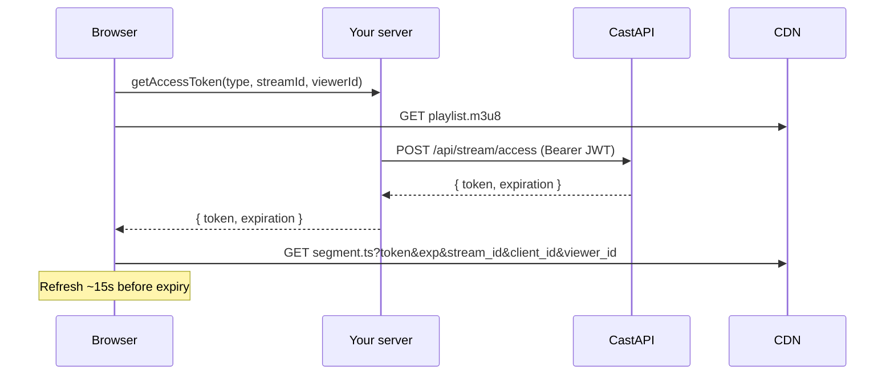

# `@convay/cast-sdk`

Browser SDK for **gated HLS playback** (live and VOD).

You render a player and supply `getAccessToken` that calls **your** server. The SDK **never calls CastAPI**. Secrets stay on the server; the browser only gets short-lived segment tokens.

| | |
|--|--|
| **In scope** | Playback + segment auth |
| **Out of scope** | Stream create / upload / status / end / billing |
| **Status** | Live and VOD types work in the SDK (`TYPES.LIVE` / `TYPES.VOD`). Your server/CastAPI must support access for that `streamId`. |
| **Limitation** | Requires `hls.js` (`Hls.isSupported()`). No native Safari HLS fallback yet. |

---

## Install

```bash
npm install @convay/cast-sdk hls.js
# React only:
npm install react react-dom
```

Until published: `npm install ../stream-web-sdk` then `npm install hls.js`.

| Import | Peer deps |
|--------|-----------|
| `@convay/cast-sdk` | `hls.js` |
| `@convay/cast-sdk/react` | `hls.js`, `react`, `react-dom` |
| `@convay/cast-sdk/element` | `hls.js` |

---

## System context

```
Browser  ──>  Your server  ──>  CastAPI  ──>  CDN
```

| System | Role |
|--------|------|
| Browser | Player + `getAccessToken` |
| Your server | Holds CastAPI JWT; validates viewer; mints access via CastAPI |
| CastAPI | Returns `{ token, expiration }` |
| CDN | Serves `.m3u8` (no auth) and `.ts` (token required) |

You supply `streamId`, `clientId`, and `playbackUrl` from your own APIs.

---

## Choose one integration path

| Your stack | Use | Import |
|------------|-----|--------|
| React | **1. `CastPlayer`** | `@convay/cast-sdk/react` |
| Vue / Angular / Svelte / plain HTML | **2. `<cast-player>`** | `@convay/cast-sdk/element` |
| You already own a `<video>` | **3. `createCastPlayer`** | `@convay/cast-sdk` |
| You own the full `hls.js` setup | **4. Headless helpers** | `@convay/cast-sdk` |

Same `getAccessToken` contract and segment auth for all four. Paths 1–2 wrap path 3. Path 4 is lowest level.

Every path needs: `type`, `streamId`, `clientId`, `playbackUrl`, `getAccessToken`.

---

### Shared: `getAccessToken` (required for all paths)

SDK calls this on the first `.ts` request and again ~15s before token expiry.

**Input:**

```ts
{ type: 'live' | 'vod', streamId: string, clientId: string, viewerId: string }
```

**Output:**

```ts
{ token: string, expiration: number } // expiration = unix seconds
```

**Browser -> your server (example):**

```ts
async function getAccessToken({ type, streamId, viewerId }) {
  // `type` is for your server (live vs vod routing / checks). CastAPI access body does not use it today.
  const res = await fetch('/api/cast/access', {
    method: 'POST',
    credentials: 'include',
    headers: { 'Content-Type': 'application/json' },
    body: JSON.stringify({ type, streamId, viewerId }),
  });
  if (!res.ok) throw new Error('Access failed');
  return res.json(); // { token, expiration }
}
```

**Your server -> CastAPI:**

```
POST /api/stream/access
Authorization: Bearer <CastAPI JWT>
Body: { stream_id, viewer_id }
-> envelope data: { token, expiration }
```

`type` stays between the browser and your server (and any VOD-specific logic you add). CastAPI’s access endpoint currently takes only `stream_id` + `viewer_id`.

Never put the CastAPI JWT in the browser.

---

### 1. React — `CastPlayer`

```tsx
import { CastPlayer, TYPES } from '@convay/cast-sdk/react';

<CastPlayer
  type={TYPES.LIVE}
  streamId={streamId}
  clientId={clientId}
  playbackUrl={playbackUrl}
  getAccessToken={getAccessToken}
  onError={(err) => console.error(err)}
  onReady={() => console.log('ready')}
/>
```

For VOD: `type={TYPES.VOD}` with that asset’s `streamId` / `playbackUrl`.

| Prop | Required | Notes |
|------|----------|--------|
| `type` | yes | `TYPES.LIVE` or `TYPES.VOD` |
| `streamId` | yes | Stream / asset id |
| `clientId` | yes | Partner account id |
| `playbackUrl` | yes | HLS `.m3u8` URL |
| `getAccessToken` | yes | See shared contract above |
| `viewerId` | no | Else UUID in `localStorage` (`cast_sdk:viewer_id`) |
| `autoPlay` / `muted` / `controls` / `className` | no | Video / wrapper |
| `poster` | no | Image URL, see [Branding](#branding) |
| `logo` | no | `{ src, position?, opacity? }`, see [Branding](#branding) |
| `onError` / `onReady` | no | Fatal errors; manifest parsed |

Built-in UI: quality select (Auto + ladder), LIVE badge, **Go live** (live only).

---

### 2. Web component — `<cast-player>`

For non-React frameworks. Import once to register the custom element.

```html
<script type="module">
  import '@convay/cast-sdk/element';

  const el = document.querySelector('cast-player');
  el.getAccessToken = getAccessToken; // must be a JS property, not an HTML attribute
  el.addEventListener('ready', () => console.log('ready'));
  el.addEventListener('error', (e) => console.error(e.detail));
  el.addEventListener('levels', (e) => console.log(e.detail));
</script>

<cast-player
  type="live"
  stream-id="abc123"
  client-id="partnerClient12"
  playback-url="https://cdn.example/hls/abc123/stream.m3u8"
></cast-player>
```

| Attribute | Maps to |
|-----------|---------|
| `type` | `live` \| `vod` |
| `stream-id` | `streamId` |
| `client-id` | `clientId` |
| `playback-url` | `playbackUrl` |
| `viewer-id` | optional |
| `autoplay` / `muted` / `controls` | `<video>` |
| `poster` / `logo-src` / `logo-position` / `logo-opacity` | Branding, see below |

Events: `ready`, `error` (`detail: Error`), `levels` (`detail: QualityLevel[]`).  
Methods: `syncToLive()`, `setLevel(n)`, `getLevels()`, `getCurrentLevel()`.  
Properties: `getAccessToken`, `logo` (set `{ src, position, opacity }` instead of the three attributes).  
Same chrome as React (quality + Go live).

---

### Branding

Both optional, both updatable at runtime — changing either only re-renders the
overlay, it never restarts HLS playback.

**Poster** — an image URL. It covers the player before the first frame plays,
and comes back when playback ends or a fatal error occurs. Clicking it starts
playback.

**Logo** — a client watermark drawn over the video.

| Option | Default | Notes |
|--------|---------|-------|
| `src` | — | Required; without it nothing is rendered |
| `position` | `top-right` | `top-left` \| `top-right` \| `bottom-left` \| `bottom-right` |
| `opacity` | `0.85` | Clamped to `0..1` |

Height is fixed at 9% of the player (capped at 40% width) so the logo scales
with the video, and it is click-through so it never blocks the controls. Top
placements sit below the badge / quality row so the built-in chrome never covers
the logo.

```tsx
<CastPlayer
  /* … */
  poster="https://cdn.example/poster.jpg"
  logo={{ src: 'https://cdn.example/logo.png', position: 'bottom-right', opacity: 0.7 }}
/>
```

```html
<cast-player
  poster="https://cdn.example/poster.jpg"
  logo-src="https://cdn.example/logo.png"
  logo-position="bottom-right"
  logo-opacity="0.7"
></cast-player>
```

Not available in the vanilla `createCastPlayer` path — it does not own any DOM
beyond the `<video>` you pass in.

---

### 3. Vanilla — `createCastPlayer`

You provide the `<video>`; SDK owns `hls.js` + auth + optional UI hooks.

```js
import { createCastPlayer, TYPES } from '@convay/cast-sdk';

const player = createCastPlayer(videoElement, {
  type: TYPES.LIVE,
  streamId,
  clientId,
  playbackUrl,
  getAccessToken,
  onError: (err) => console.error(err),
  onReady: () => console.log('ready'),
  onLevels: (levels) => { /* build your quality UI */ },
  onLevelChange: (level) => { /* sync UI */ },
});

player.setLevel(-1);   // Auto ABR
player.syncToLive();   // live only
player.destroy();      // cleanup
```

| Handle | Notes |
|--------|--------|
| `getLevels()` / `getCurrentLevel()` / `setLevel(n)` | `-1` = Auto |
| `syncToLive()` | Seek to live edge; no-op for VOD |
| `isLive()` | From `type` |
| `destroy()` | Tear down |

No built-in chrome — use callbacks/methods, or prefer paths 1–2.

---

### 4. Headless — own `hls.js`

Full control. You create `Hls`, attach media, and handle UI yourself.

```js
import Hls from 'hls.js';
import { createTokenRefreshFunction, createHlsConfig, getOrCreateViewerId, TYPES } from '@convay/cast-sdk';

const viewerId = getOrCreateViewerId();

const tokenRefresh = createTokenRefreshFunction({
  type: TYPES.LIVE,
  streamId,
  clientId,
  viewerId,
  getAccessToken,
});

const hls = new Hls(createHlsConfig({ playbackUrl, tokenRefresh }));
hls.loadSource(playbackUrl);
hls.attachMedia(videoElement);

// later: hls.destroy();
```

`createHlsConfig` installs `xhrSetup` that refreshes the token and appends query params on `.ts` requests. Playlists stay unauthenticated.

---

## Identifiers

| Name | Role |
|------|------|
| `clientId` | Partner account; query param on `.ts` |
| `streamId` | Live or VOD id (use `type` to distinguish) |
| `playbackUrl` | `.m3u8` URL (no auth) |
| `viewerId` | Viewer fingerprint; auto UUID unless overridden |

---

## Segment auth (all paths)

1. Load playlist `.m3u8` — no auth.
2. First `.ts` -> `getAccessToken` -> your server -> CastAPI.
3. SDK rewrites `.ts` URLs with:

```
?token=…&exp=…&stream_id=…&client_id=…&viewer_id=…
```

4. Refresh ~15s before `exp` (with jitter).

`type` is sent to your server via `getAccessToken`; it is not on the CDN URL. CastAPI access uses `{ stream_id, viewer_id }` only.

---

## Playback flow



---

## Security

- Never expose CastAPI JWT to the browser.
- Validate the viewer on your server before calling CastAPI.
- Only short-lived segment tokens reach the client.

---

## Types (reference)

```ts
export const TYPES = { LIVE: 'live', VOD: 'vod' } as const;

export type AccessTokenRequest = {
  type: 'live' | 'vod';
  streamId: string;
  clientId: string;
  viewerId: string;
};

export type AccessTokenDetails = {
  token: string;
  expiration: number; // unix seconds
};

export type GetAccessToken = (ctx: AccessTokenRequest) => Promise<AccessTokenDetails>;
```

---

## Build (contributors)

```bash
cd stream-web-sdk && npm install && npm run build
```
