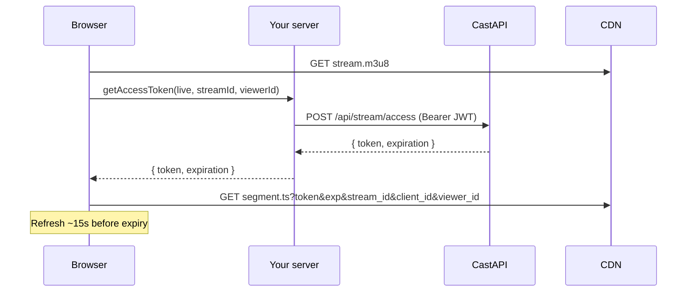
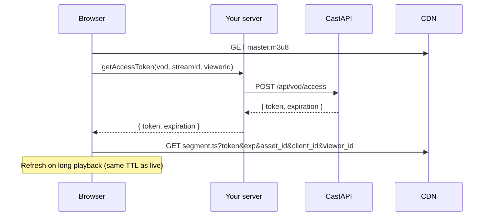

# `@convay/cast-sdk` Design

**Package:** `@convay/cast-sdk` v0.1.0  
**Status:** Live playback implemented. VOD playback designed here; not implemented in SDK or CastAPI yet.  
**Last updated:** August 2026

---

## Purpose

Browser SDK for **gated HLS playback** - live broadcasts and on-demand (VOD) streams.

You render `CastPlayer` (or use headless hls.js helpers) and supply a `getAccessToken` callback that hits **your** server. The SDK **never calls CastAPI**. Secrets stay on the server; the browser only gets short-lived segment tokens.

**In scope (SDK):** playback auth for live and VOD.  
**Out of scope (SDK):** stream lifecycle (create, upload, transcode, delete, billing). Your app and CastAPI handle those.

---

## System context

```
Browser  ──>  Your server  ──>  CastAPI  ──>  CDN (Owncast / Cloudflare)
```

| System | Role |
|--------|------|
| **Your app (browser)** | Renders player, passes `type`, `streamId`, `playbackUrl`, `getAccessToken` |
| **Your server** | Holds CastAPI JWT; validates viewer; forwards access requests |
| **CastAPI** | Mints segment tokens; validates ownership of the stream |
| **CDN** | Serves HLS; validates token + query params on `.ts` requests |

Stream keys, login, upload, status, and end-stream are **your server + CastAPI** concerns — not the SDK.

---

## Core concepts

### Identifiers

VOD is treated as a stream too. The SDK always uses `streamId`; `type` tells live vs VOD. You do not pass a separate asset id prop.

| Name | Format (live) | Format (VOD) | Where it lives | Role |
|------|---------------|--------------|----------------|------|
| `clientId` | 12-char id | same | You pass to SDK | Account that owns the stream; bound into token + query params |
| `streamId` | 15-char base36 | e.g. `vod_asset_…` | Your app | The stream being played (live or VOD — inferred from `type`) |
| `viewerId` | UUID | UUID | Browser (`localStorage`) unless overridden | Viewer fingerprint; bound into token |
| `playbackUrl` | HLS playlist URL | HLS playlist URL | Your app | `.m3u8` URL; loaded **without** auth |

You obtain `streamId`, `clientId`, and `playbackUrl` from your own APIs (share links, CMS, etc.).

### Credentials

| Credential | Lives in | Purpose |
|------------|----------|---------|
| CastAPI JWT | Your server only | CastAPI access calls |
| Segment token | Browser (short TTL, ~2 min) | Query param on `.ts` URLs |
| `viewerId` | Browser | Bound into segment token |

---

## Playback modes

Both modes share one SDK surface. Pass `type` to select the mode; `streamId` is always the same prop:

```ts
import { TYPES } from '@convay/cast-sdk';

TYPES.LIVE  // live broadcast
TYPES.VOD   // recorded / on-demand stream
```

### Comparison

| | **Live** (`TYPES.LIVE`) | **VOD** (`TYPES.VOD`) |
|--|-------------------------|------------------------|
| `streamId` means | live stream id | VOD stream id (e.g. `vod_asset_…`) |
| `playbackUrl` | e.g. `https://cdn/hls/{id}/stream.m3u8` | e.g. `https://cdn/vod/{id}/index.m3u8` |
| Playlist auth | None | None |
| Segment auth | Token on `.ts` only | Same model |
| Segment query param for id | `stream_id` | `asset_id` (value still comes from `streamId`) |
| Token refresh during playback | Yes (~15s before expiry) | Yes (same mechanism; long streams need refresh) |
| CDN billing metric | Viewer-minutes (live) | Bytes transferred (VOD) |

---

## Segment auth (live and VOD)

Shared rules:

1. **Playlist** (`.m3u8`) — no auth.
2. **First `.ts` request** — SDK calls `getAccessToken({ type, streamId, clientId, viewerId })` → your server → CastAPI.
3. **Segment URLs** — SDK appends auth query params (see below).
4. **Refresh** — ~15s before expiry (with ±3s jitter). Required for VOD longer than token TTL.

### Segment query params

| Param | Live | VOD |
|-------|------|-----|
| `token` | ✓ | ✓ |
| `exp` | ✓ (unix seconds) | ✓ |
| `client_id` | ✓ | ✓ |
| `viewer_id` | ✓ | ✓ |
| `stream_id` | ✓ (= `streamId`) | — |
| `asset_id` | — | ✓ (= `streamId`) |

The SDK picks `stream_id` vs `asset_id` from `type`. Token value and expiry come from your server (`{ token, expiration }`); minting is CastAPI’s responsibility.

---

## Your server contract

The SDK only needs your server to expose an **access route** the browser can call. Shape is the same for live and VOD; your server branches on `type`.

### Browser → your server

`getAccessToken` receives:

```ts
{ type: 'live' | 'vod', streamId: string, clientId: string, viewerId: string }
```

Your server responds:

```json
{ "token": "<segment-token>", "expiration": 1735689600 }
```

(`expiration` is unix seconds, same as live.)

Example route (conceptual):

```
POST /api/cast/access
Body: { type, streamId, viewerId }   // clientId may come from session instead
```

### Your server → CastAPI

| Mode | CastAPI route (proposed) | Request body | Auth |
|------|--------------------------|--------------|------|
| Live | `POST /api/stream/access` *(exists)* | `{ stream_id, viewer_id }` | `Bearer <CastAPI JWT>` |
| VOD | `POST /api/vod/access` *(new)* | `{ asset_id, viewer_id }` | No Auth ATM |

CastAPI checks:

- Caller owns the stream (`client_id` from JWT matches owner).
- Stream exists and is playable (live: active or recently ended per product rules; VOD: published).
- Returns `{ token, expiration }`.

Errors propagate to the browser via `getAccessToken` throw / non-2xx (403 forbidden, 404 not found, 429 rate limit — same semantics as live).

---

## Public API (SDK)

Two integration paths — **pick one per player**, not both. Same segment auth either way.

| Path | When to use |
|------|-------------|
| **`CastPlayer`** | React apps; drop-in `<video>` player |
| **Headless helpers + hls.js** | Non-React, custom UI, or full control over the Hls instance |

`CastPlayer` already uses hls.js and the headless helpers internally (`createTokenRefreshFunction`, `createHlsConfig`). You only wire hls.js yourself if you skip `CastPlayer`. Both paths need `hls.js`; the React path also needs `react`.

Both accept `type: TYPES.LIVE | TYPES.VOD` and the same `streamId` prop.

### 1. `CastPlayer` — React (primary)

```tsx
import { CastPlayer, TYPES } from '@convay/cast-sdk/react';

// Live
<CastPlayer
  type={TYPES.LIVE}
  streamId={liveStreamId}
  clientId={clientId}
  playbackUrl={livePlaylistUrl}
  getAccessToken={accessTokenHandlerFn}
/>

// VOD — same prop name; type says it's VOD
<CastPlayer
  type={TYPES.VOD}
  streamId={vodStreamId}
  clientId={clientId}
  playbackUrl={vodPlaylistUrl}
  getAccessToken={accessTokenHandlerFn}
/>
```

Required props: `type`, `streamId`, `clientId`, `playbackUrl`, `getAccessToken`.

Optional: `viewerId`, `autoPlay`, `muted`, `controls`, `className`, `poster`, `onError`, `onReady`.

### 2. Headless — custom player

```js
import Hls from 'hls.js';
import { createTokenRefreshFunction, createHlsConfig, TYPES } from '@convay/cast-sdk';

const tokenRefresh = createTokenRefreshFunction({
  type: TYPES.VOD,
  streamId: vodStreamId,
  clientId,
  viewerId,
  getAccessToken,
});

const hls = new Hls(createHlsConfig({ playbackUrl, tokenRefresh }));
hls.loadSource(playbackUrl);
hls.attachMedia(video);
```

### SDK internal behavior by type

| Module | Live | VOD |
|--------|------|-----|
| `createTokenRefreshFunction` | `segmentAuthParams.stream_id = streamId` | `segmentAuthParams.asset_id = streamId` |
| `createSegmentXhrSetup` | Auth on `.ts` only | Same |

---

## Playback flows

### Live



### VOD



---

## Package layout

| Import | Use for |
|--------|---------|
| `@convay/cast-sdk` | HLS helpers, `TYPES`, token refresh |
| `@convay/cast-sdk/react` | `CastPlayer` |

Peer deps: `hls.js`, `react` (optional if not using React layer).

---

## Security

- **Never** expose the CastAPI JWT to the browser.
- Your server validates the viewer (session, share token, paywall, etc.) before calling CastAPI access.
- Only short-lived segment tokens reach the client.
- Tokens are bound to `client_id`, the stream id (`stream_id` or `asset_id` from `type`), and `viewer_id` — CDN rejects mismatched params.

---

## Types (reference)

```ts
export const TYPES = { LIVE: 'live', VOD: 'vod' } as const;

export type AccessTokenRequest = {
  type: PlaybackType;
  streamId: string;
  clientId: string;
  viewerId: string;
};

export type AccessTokenDetails = {
  token: string;
  expiration: number; // unix seconds
};

export type GetAccessToken = (ctx: AccessTokenRequest) => Promise<AccessTokenDetails>;
```

Segment auth params are inferred from `type` at runtime (`stream_id` vs `asset_id`); both carry the same `streamId` value.
